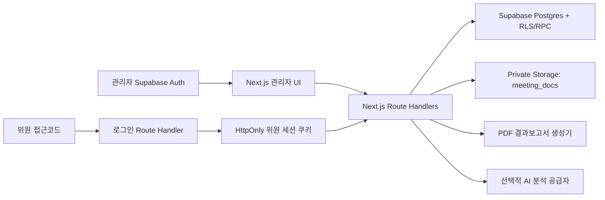

# 위원회 운영 시스템 상세 설계

> 버전: 1.1.0 | 작성일: 2026-07-23 | 상태: Approved for development/staging implementation
> 계획: [committee-operations.plan.md](../../01-plan/features/committee-operations.plan.md)

## 1. 설계 목표

- 위원회 생성, 자료 배포, 심의, 서명, 결과보고서를 단일 감사 흐름으로 연결한다.
- PDF 원문 접근은 DB 권한과 동일하게 통제하고 public Storage URL을 사용하지 않는다.
- 위원은 대학 계정이 없어도 위원별 접근코드로 제한된 위원회에만 접근한다.
- 집계·AI 요약·보고서의 모든 결과를 의안과 제출 데이터까지 추적한다.
- 1~2년 단위의 위원회 구성과 개별 운영 회차를 분리하고, 개최일 기준 유효 명단을 재사용한다.
- 인사명령에 따른 위원 교체는 기존 임명 행을 종료하고 새 임명 행을 추가해 과거 명단을 보존한다.

## 2. 아키텍처와 신뢰 경계



### 2.1 관리자 경계

- 관리자 UI는 Supabase Auth access token을 `Authorization: Bearer`로 서버에 전달한다.
- 서버는 `auth.getUser(token)`으로 사용자 신원을 검증하고 DB의 활성 `memberships` 역할을 재확인한다.
- `super_admin`, `executive`, `manager`, `editor` 중 위원회 소유 조직에 쓰기 권한이 있는 사용자만 변경한다.

### 2.2 외부 위원 경계

- 로그인 입력은 `committeeCode`, `memberCode`, `securityCode`이다.
- `authenticate_committee_member` RPC가 `pgcrypto.crypt`로 코드 해시를 비교하고 원문 세션 토큰을 한 번만 반환한다.
- DB에는 세션 토큰 SHA-256 해시만 저장한다. 브라우저에는 HttpOnly 쿠키만 저장한다.
- 이후 API는 세션 해시, 만료, 위원/위원회 활성 상태를 매 요청 확인한다.

### 2.3 Storage 경계

- 버킷: `meeting_docs`, `public=false`, PDF MIME만 허용, 파일당 20MB.
- 경로: `{committee_id}/{agenda_id}/{document_id}.pdf`.
- 업로드는 인증된 관리자 서버 경로 또는 RLS가 허용한 Supabase Auth 사용자만 가능하다.
- 열람은 서버가 문서-의안-위원회 접근권한을 확인한 뒤 300초 signed URL을 발급한다.
- 위원 브라우저에는 bucket/path 및 장기 URL을 노출하지 않는다.

## 3. 데이터 모델

### 3.1 핵심 테이블

| 테이블 | 주요 필드 | 규칙 |
|---|---|---|
| `committee_compositions` | `code`, `name`, `committee_type`, `term_start`, `term_end`, `status`, `created_by` | 1~2년 임기 단위 구성 마스터 |
| `committee_composition_members` | `composition_id`, `member_code`, `name`, `role`, `valid_from`, `valid_to`, `predecessor_id`, `appointment_reference` | 구성원 임명 이력, 기존 행 덮어쓰기 금지 |
| `committees` | `composition_id`, `code`, `name`, `committee_type`, `owner_org_id`, `status`, `meeting_at`, `security_notice` | 구성 마스터를 참조하는 개별 운영 회차 |
| `committee_members` | `committee_id`, `composition_member_id`, `member_code`, `name`, `email`, `role`, `access_code_hash`, `status` | 회차 생성 시 확정한 명단 스냅샷 |
| `committee_agendas` | `committee_id`, `agenda_no`, `title`, `description`, `decision_type`, `status` | 순번 유일 |
| `committee_documents` | `agenda_id`, `title`, `bucket_id`, `storage_path`, `mime_type`, `size_bytes`, `sha256` | PDF만, 원본명 별도 보존 |
| `committee_member_sessions` | `member_id`, `token_hash`, `expires_at`, `last_seen_at`, `revoked_at` | 토큰 원문 저장 금지 |
| `committee_document_reads` | `document_id`, `member_id`, `first_opened_at`, `last_opened_at`, `open_count` | upsert로 열람 추적 |
| `committee_reviews` | `agenda_id`, `member_id`, `decision`, `comment`, `status`, `submitted_at` | 의안/위원 유일, submitted 이후 잠금 |
| `committee_signatures` | `committee_id`, `member_id`, `signer_name`, `consent_version`, `signed_at`, 증적 해시 | 위원회/위원 유일 |
| `committee_analysis_runs` | `committee_id`, `provider`, `model`, `prompt_version`, `input_digest`, `summary`, `evidence`, `status` | 검토 상태와 근거 JSON |
| `committee_reports` | `committee_id`, `document_id`, `version`, `generated_at`, `snapshot` | 보고서 생성 시점 스냅샷 |
| `audit_logs` | 기존 공통 테이블 | 민감 변경 append-only |

### 3.2 상태 흐름

```text
위원회: draft -> open -> closed -> reported
의안: draft -> open -> closed
심의: draft -> submitted (관리자 reopen 시에만 draft 복귀 + 감사로그)
분석: generated -> reviewed -> approved 또는 rejected
```

### 3.3 구성과 운영 회차 분리

- 위원회 구성은 임기 시작일과 종료일을 갖는 독립 마스터이며 여러 운영 회차에서 재사용한다.
- 구성원 교체 시 기존 행의 `valid_to`와 `status=replaced`를 기록하고, `predecessor_id`를 가진 새 행을 추가한다.
- 운영 회차 생성 시 `meeting_at` 날짜에 유효한 구성원만 조회하여 `committee_members`에 이름·역할·이메일을 복사한다.
- 회차 스냅샷은 이후 구성원 인사변경의 영향을 받지 않는다.
- 접근 보안코드는 장기 구성 마스터에 저장하지 않고 운영 회차마다 새로 설정하며 해시만 보관한다.

### 3.4 삭제와 보존

- 제출 심의, 서명, 보고서는 물리 삭제하지 않는다.
- 위원 개인정보는 보존정책 확정 후 파기 작업을 연결한다. MVP에서는 비활성화만 지원한다.
- 문서 교체는 기존 Storage object 삭제가 아니라 새 document/version 행을 생성한다.
- 구성원 교체는 물리 삭제나 기존 행 수정으로 대체하지 않고 유효기간 종료+후임 행 추가로 관리한다.

## 4. 권한/RLS 설계

### 4.1 DB 업무 테이블

- 기본값은 모든 역할에 거부한다.
- Supabase Auth 사용자는 `can_manage_committee(owner_org_id)` 함수가 참일 때 관리 테이블을 조회/변경한다.
- executive/auditor의 읽기 범위는 승인된 조직 정책이 확정되기 전 개발환경에서만 전체 조회를 허용한다.
- 외부 위원은 테이블 직접 권한이 없고 제한된 SECURITY DEFINER RPC/Next.js API만 사용한다.

### 4.2 Storage 정책

- INSERT: `meeting_docs/{committee_id}/...` 경로의 위원회 관리 권한 확인.
- SELECT: 관리자만 직접 허용. 외부 위원은 service-role 서버의 signed URL 발급을 통해서만 접근.
- UPDATE/DELETE: 기본 거부. 교체는 새 버전 업로드로 처리.

### 4.3 감사 이벤트

- 위원회/위원/의안 생성 및 상태변경
- 문서 업로드와 signed URL 발급
- 로그인 성공/실패(코드·IP 원문 미기록)
- 심의 제출/재개방, 서명, 분석 생성/승인, 보고서 생성

## 5. API 계약

| Method | 경로 | 인증 | 목적 |
|---|---|---|---|
| `GET/POST` | `/api/committee-compositions` | Supabase 관리자 | 임기별 위원회 구성·명단 조회/생성 |
| `POST` | `/api/committee-compositions/[id]/members` | Supabase 관리자 | 위원 추가 또는 인사명령에 따른 교체 |
| `POST` | `/api/committees` | Supabase 관리자 | 구성 명단을 불러와 운영 회차+위원 스냅샷+의안 생성 |
| `POST` | `/api/committees/[id]/documents` | Supabase 관리자 | PDF 검증·Storage 업로드·메타데이터 생성 |
| `GET` | `/api/committees/[id]/overview` | Supabase 관리자 | 참여현황·집계·분석 조회 |
| `POST` | `/api/committee-member/login` | 공개+rate limit | 위원 접근코드 검증·쿠키 발급 |
| `POST` | `/api/committee-member/logout` | 위원 쿠키 | 세션 폐기 |
| `GET` | `/api/committee-member/workspace` | 위원 쿠키 | 허용된 위원회/의안/문서/제출 상태 |
| `POST` | `/api/committee-member/documents/[id]/open` | 위원 쿠키 | 열람 기록+300초 signed URL |
| `PUT` | `/api/committee-member/agendas/[id]/review` | 위원 쿠키 | draft 저장 또는 최종 제출 |
| `POST` | `/api/committee-member/signature` | 위원 쿠키 | 모든 필수 심의 제출 확인 후 서명 |
| `POST` | `/api/committees/[id]/analysis` | Supabase 관리자 | 비식별 집계 기반 분석 생성 |
| `POST` | `/api/committees/[id]/report` | Supabase 관리자 | 결과보고서 PDF 생성·Storage 보관 |

공통 오류는 `{ error: { code, message, traceId } }`이며 민감한 DB/Storage 오류 원문은 반환하지 않는다.

## 6. UI 설계

### 6.1 관리자 워크스페이스

- 위원회 구성 영역: 임기별 구성 목록, 현재 유효 명단, 구성 등록, 개별 위원 인사변경
- 상단: 위원회 수, 진행 중, 평균 참여율, 서명 완료율
- 위원회 목록: 종류/일시/상태/의안/위원/진행률
- 운영 생성 패널: 기본정보 -> 구성 명단 선택/불러오기 -> 회차별 보안코드 -> 의안 -> PDF 업로드
- 상세: 참여현황 테이블(미접속/자료열람/심의완료/서명완료), 의안별 표결, AI 분석, 보고서 생성

### 6.2 위원 페이지

- `/committee/login`: 위원회 코드, 위원 코드, 접근코드 입력
- `/committee`: 위원회 안내, 의안 탭, 인앱 PDF iframe/object 리더, 결정/의견, 제출 상태
- 마지막 단계에서 모든 필수 의안 제출을 확인하고 서명자 이름+동의 체크로 서명한다.
- 모바일에서도 심의는 가능하되 PDF 열람은 태블릿/데스크톱을 권장한다.

## 7. AI 종합분석

- 입력: 참석/열람/제출/서명 집계, 의안별 결정 수, 비식별 의견 목록.
- 기본 구현은 공급자 미설정 시 규칙 기반 요약을 생성한다.
- 공급자 설정 시 서버에서만 호출하며 원문 PDF와 이름/이메일은 입력하지 않는다.
- 출력: 핵심 결론, 이견/쟁점, 참여 공백, 후속조치 제안, 근거 수치.
- 출력은 `generated` 상태이며 간사 검토 후에만 결과보고서에 ‘검토완료 분석’으로 포함한다.

## 8. PDF 결과보고서

- 서버 Route Handler가 HTML 기반 인쇄 뷰 또는 PDF 라이브러리로 A4 보고서를 생성한다.
- 구성: 표지, 위원회 개요, 구성원, 의안/결정 집계, 참여현황, 서명 목록, 검토된 분석, 감사 식별자.
- PDF를 `meeting_docs/{committee_id}/reports/...pdf`에 저장하고 SHA-256과 생성 스냅샷을 기록한다.
- 생성 후 PDF 파싱과 PNG 렌더링으로 페이지, 한글 글꼴, 잘림/겹침을 검증한다.

## 9. 파일 구조

```text
app/
  committee/login/page.tsx
  committee/page.tsx
  api/committee-member/**/route.ts
  api/committees/**/route.ts
components/committee/
  committee-admin.tsx
  committee-workspace.tsx
lib/committee/
  auth.ts
  repository.ts
  validation.ts
  report.ts
lib/supabase/
  server.ts
supabase/migrations/*_committee_operations.sql
supabase/tests/committee_rls.sql
```

## 10. 검증 계획

1. migration 구문, enum/check/FK/unique/index 검증
2. 역할×조직 RLS 허용/거부 및 외부 위원 직접 조회 거부
3. 잘못된 코드, 만료/폐기 세션, 다른 위원회 문서 IDOR 거부
4. `.pdf` 위장 파일, 잘못된 MIME, 20MB 초과 업로드 거부
5. 제출 후 수정 금지, 다른 위원 심의/서명 접근 거부
6. signed URL 만료, 열람횟수 추적, public bucket 아님 확인
7. 보고서 집계와 DB 스냅샷 일치, PNG 렌더링 육안 확인
8. Next.js typecheck, lint, production build, 키보드/레이블 점검

## 11. 개발 착수 게이트와 운영 게이트

### 개발/스테이징 착수(이번 범위)

- 합성 데이터와 비운영 Supabase만 사용한다.
- 외부 발송, 공인전자서명, 운영 AI 호출은 비활성화한다.

### 운영 전 별도 승인 필수

- [ ] 위원 개인정보 항목, 수집 동의, 보존·파기 기간
- [ ] 위원회별 자료 보안등급, 다운로드/인쇄 정책
- [ ] 접근코드 발급·전달·재발급·잠금 정책과 MFA 필요 여부
- [ ] 전자서명의 요구 법적 수준과 인증사업자 연계 여부
- [ ] AI 공급자, 데이터 처리지역, 위탁계약, 외부전송 범위
- [ ] 운영/Preview Supabase 분리와 `service_role` 비밀관리
- [ ] 보고서 결재·확정·폐기 절차

## 12. ADR

| ID | 결정 | 상태 |
|---|---|---|
| COM-001 | 외부 위원은 위원별 접근코드+HttpOnly 제한 세션 사용 | Accepted for staging |
| COM-002 | PDF는 private `meeting_docs`+5분 signed URL | Accepted for staging |
| COM-003 | 심의/서명은 append-only 증적과 스냅샷 보존 | Accepted for staging |
| COM-004 | AI는 비식별 집계만 사용하고 사람 승인 전 초안 | Accepted for staging |
| COM-005 | MVP 서명은 공인전자서명이 아닌 감사 가능한 일반 전자서명 | Accepted for staging |
| COM-006 | 임기별 구성은 유효기간 이력으로 관리하고 운영 회차에는 명단 스냅샷을 복사 | Accepted for staging |
| COM-007 | 구성 마스터에는 접근코드를 저장하지 않고 운영 회차마다 별도 발급 | Accepted for staging |
