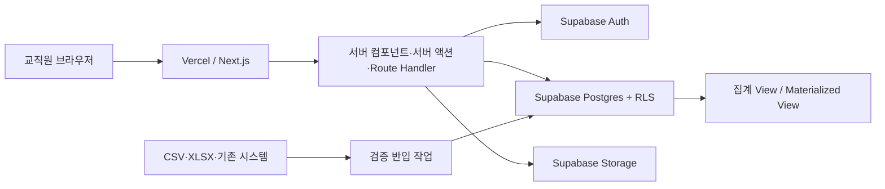

# 울산과학대학교 산학협력단 성과관리 대시보드 설계서

> **요약**: 조직·사업·재정·성과·문서 데이터를 통합해 단장의 의사결정을 지원하는 내부용 IR 대시보드 기술·서비스 설계
>
> **프로젝트**: 울산과학대학교 산학협력단 통합 성과관리
> **버전**: 0.1
> **작성**: Codex 초안 / 산학협력단 검토
> **작성일**: 2026-07-20
> **상태**: Draft — 구현 전 정책·지표 승인 필요
> **계획서**: [uc-industry-cooperation-dashboard.plan.md](../../01-plan/features/uc-industry-cooperation-dashboard.plan.md)

---

## 1. 설계 목표와 원칙

### 1.1 핵심 목표

1. 단장이 30초 안에 전체 상태와 개입이 필요한 항목을 파악한다.
2. 모든 요약 수치에서 조직·사업·기간·원천자료까지 추적한다.
3. 현재 조직도와 업무별 문서 구조를 하나의 탐색 체계로 통합한다.
4. 조직별 자율 입력을 허용하되 지표 정의, 검증, 권한은 중앙에서 통제한다.
5. 기존 앵커사업 대시보드와 유사한 시각 언어를 사용해 학습 부담을 낮춘다.

### 1.2 설계 원칙

- **요약에서 근거로**: 홈 → 조직/사업 → 지표/거래 → 증빙의 단계적 공개
- **기준일 우선**: 모든 카드에 기준기간, 갱신시각, 검증상태를 표시
- **단일 지표 사전**: 지표명, 산식, 단위, 주기, 오너를 중앙 정의
- **행 단위 최소권한**: UI 숨김이 아니라 Supabase RLS로 데이터 경계를 보장
- **이력 보존**: 조직개편, 목표변경, 수치수정의 과거 상태를 보존
- **입력보다 연계**: 원천 시스템이 있으면 링크/수집하고 중복 수기 입력을 최소화

## 2. 사용자 제공 이미지 해석

| 이미지 | 반영 내용 |
|---|---|
| 조직도 | 산학협력단장·부단장·기업인재교육본부장과 팀/연구소/부속기관/사업기구/학교기업/국책사업단의 계층형 조직 마스터 |
| 업무 트리 1~2 | `00~08` 번호 체계, 조직별 회의·정관·인사·연구지원·지식재산·가족회사·사업 문서를 탐색하는 좌측 트리 |
| 앵커사업 IR | 고정 사이드바, 상단 연도 전환, 큰 요약 카드, 예산/집행 카드, 막대·도넛 차트, 동기화·Wiki·테마·사용자 도구 |

이미지의 폴더명과 조직명은 초기 데이터 시드 후보이며, 구현 전 최신 공식 조직도와 규정으로 확정한다.

## 3. 초기 조직 마스터

`organizations`는 `parent_id`, `type`, `valid_from`, `valid_to`, `sort_order`를 가진다. 동일 명칭 조직의 개편 이력을 덮어쓰지 않는다.

```text
산학협력단장
├─ 산학협력부단장
│  ├─ 산학기획팀
│  ├─ 산학지원팀
│  ├─ 연구소
│  │  ├─ 지역혁신연구소
│  │  └─ 이차전지연구소
│  ├─ 부속기관
│  │  ├─ 현장실습지원센터
│  │  ├─ 창업창직교육센터
│  │  └─ 울산광역시탄소중립지원센터
│  └─ 학교기업
│     ├─ 종합환경분석센터
│     ├─ 영상콘텐츠제작센터
│     └─ 스포츠재활운동센터
├─ 기업인재교육본부장
│  └─ 기업인재교육본부
│     └─ 일학습병행제사업단
│        └─ 고교단계종합환경분석센터
│           └─ 지역산업맞춤형인력양성사업단
├─ 사업기구
│  ├─ 어린이급식관리사업단
│  │  ├─ 동구어린이·사회복지급식센터
│  │  ├─ 남구어린이·사회복지급식센터
│  │  └─ 북구어린이·사회복지급식센터
│  └─ 간호시뮬레이션센터
└─ 국책사업단
   ├─ 차세대통신혁신융합대학사업단(NCCOSS)
   ├─ 첨단산업인재양성부트캠프사업단
   ├─ 기술사관육성사업단
   ├─ 창업교육혁신사업단(SCOUT)
   ├─ 유아교육보육혁신지원사업단
   ├─ 전문대학혁신지원사업단
   ├─ AID전환중점전문대학지원사업단
   └─ RISE사업단
```

주의: 이미지에서 일부 연결선은 행정 지휘선인지 시각 배치용인지 불명확하다. 위 계층은 초기 가설이며 `organization_relations`로 지휘, 협업, 참여 관계를 별도 표현할 수 있게 한다.

## 4. 정보구조(IA)와 내비게이션

### 4.1 전역 프레임

```text
┌──────────────────────────────────────────────────────────────────┐
│ UC 로고 | 산학협력단 통합 IR | 기간 전환 | 검색 | 동기화 | 사용자 │
├───────────────┬──────────────────────────────────────────────────┤
│ 좌측 내비게이션 │ 페이지 제목 / 필터 / 기준일 / 액션             │
│               │ KPI 카드 / 경보                                 │
│               │ 비교 차트 / 추세 / 상세 표                       │
│               │ 근거 문서 / 최근 변경                            │
└───────────────┴──────────────────────────────────────────────────┘
```

### 4.2 1차 내비게이션

| 메뉴 | 목적 |
|---|---|
| 통합 IR 대시보드 | 전체 경영 현황과 주의 항목 |
| 조직·사업 맵 | 조직도, 책임자, 소관 사업, 조직 상세 |
| 성과지표 | 지표 사전, 목표, 실적, 달성률, 근거 |
| 예산·재정 | 재원, 예산, 집행, 월별 추세, 잔액 |
| 연구·산학협력 | 연구지원, 협약, 가족회사, 산학협력협의회 |
| 지식재산·기술사업화 | 특허, 기술이전, 사업화 실적 |
| 교육·현장실습 | 현장실습, 일학습병행, 재직자교육 |
| 회의·위원회 | 회의체, 안건, 의결, 후속조치 |
| 일정·마감 | 보고·협약·정산·평가 일정 |
| 문서·규정 | 정관, 운영규정, 보고서, 증빙, 통합검색 |
| 데이터 관리 | 반입, 검증, 동기화, 감사 로그 |

### 4.3 탐색 트리

좌측 ‘업무 탐색기’는 `organization`, `domain`, `program`, `record_collection`, `document` 노드 타입을 혼합 지원한다. 문서는 한 폴더에만 갇히지 않고 태그/연결 테이블로 여러 조직과 업무영역에 노출한다.

## 5. 핵심 화면 설계

### 5.1 통합 IR 홈(단장 기본 화면)

상단 필터: 회계연도, 사업연도, 기준월, 조직, 사업유형, 재원, 검증상태.

1행 요약 카드:

- 총 예산 / 누적 집행 / 집행률 / 전년 동기 대비
- 핵심 KPI 종합 달성률 / 미달 지표 수
- 진행 사업 수 / 종료 임박 사업 수
- 연구비·산학협력 수익 / 기술이전·지식재산 핵심 실적

2행 주의 큐:

- 예산 집행 과소·과다
- KPI 목표 미달 또는 데이터 미갱신
- 30일 이내 협약·정산·평가·보고 마감
- 검증 대기 수치 및 근거 없는 지표

3행 분석:

- 조직/사업별 예산 배정·누적 집행 막대차트
- 재원 배분 구조 도넛차트
- 조직×KPI 달성률 히트맵
- 최근 3~5년 핵심지표 추세

모든 카드는 클릭 시 적용 필터를 유지한 상세 화면으로 이동한다.

### 5.2 조직·사업 상세

- 헤더: 명칭, 유형, 책임자, 소속, 운영기간, 상태
- 요약: 예산/집행, KPI, 소관사업, 인력(허용 시), 경보
- 탭: 개요 / 성과 / 재정 / 일정 / 회의 / 문서 / 변경이력
- 조직도에서 상위·하위·협업 조직으로 이동

### 5.3 성과지표

- 지표 사전: 정의, 산식, 단위, 방향성, 측정주기, 오너, 근거 규칙
- 목표/실적: 기간별 값, 달성률, 전년 대비, 상태, 검증자
- 정성지표는 숫자 환산을 강제하지 않고 등급·서술·증빙을 지원
- 목표 변경 시 원목표를 보존하고 변경사유·승인자를 기록

### 5.4 예산·재정

- 단위는 DB에 원 단위 정수로 저장하고 UI에서 원/천원/백만원을 선택 표시
- 본예산/추경/이월/외부사업비와 재원별 구분
- 예산, 집행, 잔액, 집행률, 전년 동기 대비
- 회계 원장 대체가 아니라 경영 집계·분석용 스냅샷으로 시작

### 5.5 회의·일정·문서

- 회의: 회의체, 일시, 참석자, 안건, 의결, 담당자, 기한, 후속상태
- 일정: 마감유형, 위험도, 담당조직, 알림일, 관련사업/문서
- 문서: 제목, 문서유형, 보안등급, 버전, 기준일, 저장경로/외부링크, 검색텍스트
- 원문 접근권한과 메타데이터 조회권한을 분리 가능하게 설계

## 6. 지표 체계

### 6.1 지표 레이어

| 레이어 | 예시 | 용도 |
|---|---|---|
| 경영 핵심 | 총예산, 집행률, KPI 종합달성률, 위험 사업 수 | 단장 홈 |
| 산학협력 | 산학협력 수익, 가족회사, 협약, 기술이전 | 중장기 전략 |
| 연구지원 | 과제 수, 연구비, 신규 수주, 간접비 | 연구지원 운영 |
| 교육/인재 | 현장실습, 일학습병행, 재직자교육, 참여기업 | 교육성과 |
| 조직/사업 | 각 센터·사업단 협약지표 및 자체지표 | 책임관리 |
| 데이터 품질 | 최신성, 검증률, 근거 첨부율 | 신뢰성 관리 |

### 6.2 공통 산식

- 집행률 = 누적 집행액 / 조정 예산액 × 100
- KPI 달성률(상향지표) = 실적 / 목표 × 100
- KPI 달성률(하향지표) = 목표 / 실적 × 100 (0 처리 규칙 별도)
- 종합 달성률 = 승인된 가중치가 있는 지표의 가중 평균
- 최신성 = 현재시각 - `as_of_date`; 지표별 갱신주기 초과 시 경고

색상 임계치는 전역 상수가 아니라 지표별 `threshold_rules`에 저장한다. 100% 초과가 반드시 좋은 것은 아니므로 방향성과 상한을 정의한다.

## 7. 기술 아키텍처



### 7.1 권장 스택

- Next.js App Router + TypeScript
- Supabase: Postgres, Auth, Storage, Row Level Security
- Tailwind CSS + 접근 가능한 컴포넌트 프리미티브
- Recharts 또는 동급 SVG 차트 라이브러리
- Zod 기반 입력/반입 검증
- Vercel Preview/Production 분리

### 7.2 경계 원칙

- 조회는 가능한 한 서버에서 수행하고 클라이언트에는 필요한 행·열만 전달한다.
- `service_role` 키는 브라우저 번들에 절대 포함하지 않는다.
- 관리자 작업은 서버 전용 경로에서 권한을 재검증한다.
- 복잡한 집계는 SQL View/RPC로 중앙화하고 프런트에서 산식을 중복하지 않는다.

## 8. 데이터 모델

### 8.1 공통 컬럼 규약

주요 테이블은 `id uuid`, `created_at timestamptz`, `created_by uuid`, `updated_at`, `updated_by`, 필요 시 `deleted_at`을 가진다. 금액은 `bigint` 원 단위, 날짜는 업무 의미에 따라 `date` 또는 `timestamptz`를 사용한다.

### 8.2 핵심 엔터티

| 테이블 | 핵심 필드 | 설명 |
|---|---|---|
| `profiles` | `user_id`, `name`, `title`, `status` | 인증 사용자 프로필 |
| `roles` | `code`, `name` | super_admin, executive, manager, editor, viewer, auditor |
| `memberships` | `user_id`, `organization_id`, `role_id`, `valid_from/to` | 사용자 역할과 데이터 범위 |
| `organizations` | `parent_id`, `type`, `code`, `name`, `valid_from/to`, `sort_order` | 조직 계층과 이력 |
| `organization_relations` | `from_org_id`, `to_org_id`, `relation_type` | 협업·참여·승계 관계 |
| `fiscal_periods` | `year`, `period_type`, `start_date`, `end_date`, `is_closed` | 회계/사업 기간 |
| `programs` | `owner_org_id`, `name`, `program_type`, `start/end_date`, `status` | 사업·사업단·프로젝트 |
| `program_participants` | `program_id`, `organization_id`, `role` | 다조직 참여 관계 |
| `funding_sources` | `name`, `category`, `sponsor` | 국고, 지자체, 교비, 자체 등 |
| `budget_lines` | `period_id`, `program_id`, `organization_id`, `source_id`, `account_code`, `amount` | 승인 예산과 조정 이력 |
| `financial_snapshots` | `as_of_date`, 차원 FK, `committed_amount`, `spent_amount` | 월/일별 집계 실적 |
| `metric_definitions` | `code`, `name`, `unit`, `value_type`, `direction`, `formula`, `frequency`, `owner_org_id` | 지표 사전 |
| `metric_assignments` | `metric_id`, `organization_id/program_id`, `weight`, `threshold_rules` | 평가대상과 임계치 |
| `metric_targets` | `assignment_id`, `period_id`, `target_value`, `version`, `approved_by` | 목표와 변경이력 |
| `metric_values` | `assignment_id`, `period_id`, `as_of_date`, 값 컬럼, `verification_status`, `source_note` | 실적과 검증상태 |
| `committees` | `owner_org_id`, `name`, `committee_type` | 회의체/위원회 |
| `meetings` | `committee_id`, `held_at`, `title`, `status` | 회의와 의결 기록 |
| `action_items` | `meeting_id`, `assignee_id/org_id`, `due_date`, `status` | 후속조치 |
| `events` | `organization_id`, `program_id`, `event_type`, `starts_at`, `due_at`, `severity` | 일정·마감 |
| `documents` | `title`, `document_type`, `classification`, `storage_path`, `external_url`, `version`, `as_of_date` | 문서 메타데이터 |
| `document_links` | `document_id`, `entity_type`, `entity_id`, `relation_type` | 문서 다중 연결 |
| `alerts` | `rule_code`, 대상 FK, `severity`, `status`, `detected_at` | 주의 항목 스냅샷 |
| `import_jobs` | `file_name`, `mapping`, `status`, `error_report_path` | 데이터 반입 이력 |
| `audit_logs` | `actor_id`, `action`, `table_name`, `record_id`, `before/after`, `occurred_at` | 변경 감사 |

`document_links`의 다형 관계는 편리하지만 FK 무결성이 약하다. 구현 시 대상별 연결 테이블을 분리하거나 트리거로 무결성을 검증한다.

### 8.3 검증 상태

`draft → submitted → verified → rejected` 흐름을 공통 사용한다. 검증 완료 값 수정은 새 버전 생성 또는 검증 취소 권한을 요구한다.

## 9. 권한과 RLS

| 역할 | 전체 요약 | 상세 조회 | 입력/수정 | 검증 | 사용자/기준정보 |
|---|:---:|:---:|:---:|:---:|:---:|
| super_admin | 전체 | 전체 | 전체 | 가능 | 관리 |
| executive | 전체 | 전체 | 제한 | 가능 | 조회 |
| manager | 허용 조직 | 허용 조직/하위 | 허용 조직 | 가능 | 조회 |
| editor | 허용 조직 | 허용 조직 | 담당 데이터 | 제출 | 조회 |
| viewer | 허용 조직 | 허용 조직 | 불가 | 불가 | 조회 |
| auditor | 전체/승인범위 | 읽기 전용 | 불가 | 불가 | 감사 조회 |

RLS 정책 기준:

1. `memberships`의 유효한 조직 범위와 하위 조직을 계산한다.
2. 프로그램은 소유 조직 또는 참여 조직 권한으로 조회한다.
3. executive의 전사 집계 조회도 원천 상세의 보안등급을 우회하지 않는다.
4. `confidential` 문서는 별도 권한이 있어야 원문 URL을 발급한다.
5. Storage bucket도 DB 문서 권한과 같은 조건을 적용한다.
6. 감사 로그는 일반 사용자 수정 불가, 서버/DB 트리거로 기록한다.

## 10. 애플리케이션 인터페이스

클라이언트가 Postgres 테이블을 임의 조합하지 않도록 도메인별 조회 계약을 둔다.

| 방식 | 경로/함수 | 목적 |
|---|---|---|
| GET | `/api/dashboard/summary` | 전역 필터 기준 KPI 카드/경보 |
| GET | `/api/dashboard/finance` | 조직·사업·재원별 예산/집행 집계 |
| GET | `/api/organizations/tree` | 권한이 반영된 조직도/업무 트리 |
| GET | `/api/organizations/[id]` | 조직 상세와 탭별 요약 |
| GET | `/api/programs/[id]` | 사업 상세 |
| GET/POST | `/api/metrics` | 지표 조회/정의(관리자) |
| POST | `/api/metric-values` | 실적 입력·제출 |
| POST | `/api/imports` | 반입 작업 생성 및 검증 |
| GET | `/api/search` | 조직·사업·문서 통합검색 |

공통 응답은 `data`, `meta.asOf`, `meta.filters`, `meta.freshness`, `error`를 사용한다. 목록은 커서 페이지네이션을 기본으로 한다.

## 11. 프런트엔드 구조

```text
src/
├─ app/
│  ├─ (auth)/login/
│  ├─ (dashboard)/dashboard/
│  ├─ (dashboard)/organizations/[id]/
│  ├─ (dashboard)/programs/[id]/
│  ├─ (dashboard)/performance/
│  ├─ (dashboard)/finance/
│  ├─ (dashboard)/documents/
│  ├─ (dashboard)/calendar/
│  ├─ (dashboard)/admin/
│  └─ api/
├─ components/
│  ├─ layout/
│  ├─ dashboard/
│  ├─ charts/
│  ├─ organization/
│  ├─ data-table/
│  └─ ui/
├─ features/
│  ├─ finance/
│  ├─ metrics/
│  ├─ organizations/
│  ├─ programs/
│  ├─ meetings/
│  └─ documents/
├─ lib/supabase/
├─ lib/auth/
├─ lib/validation/
└─ types/
supabase/
├─ migrations/
├─ seed.sql
└─ tests/
```

서버/클라이언트 컴포넌트 경계를 명시하고, 차트처럼 상호작용이 필요한 부분만 클라이언트 컴포넌트로 둔다.

## 12. 시각 디자인 시스템

- 기존 앵커 대시보드처럼 밝은 회색 배경, 흰 카드, 얇은 테두리, 큰 라운드를 사용한다.
- UC 블루를 주 행동/선택 색으로 사용하고 녹색(정상), 주황(주의), 분홍/적색(미달·위험), 보라(보조)을 일관 적용한다.
- 수치는 표 형태 숫자로 정렬하고 금액 단위를 카드 제목과 함께 명시한다.
- 상태는 색상뿐 아니라 아이콘·텍스트를 함께 사용한다.
- 카드 최소 정보: 값, 단위, 비교 기준, 기준일, 상태, 상세 링크.
- 차트 범례 클릭, 툴팁, 데이터 표 보기, PNG/CSV 내보내기를 고려한다.
- 다크 모드는 후순위이며, 1차는 회의실 프로젝터와 인쇄에 적합한 라이트 테마를 완성한다.

## 13. 데이터 반입과 운영

### 13.1 초기 반입

1. 조직/사용자/사업/지표 사전을 먼저 승인한다.
2. 엑셀 템플릿을 고정하고 원본 파일을 `import_jobs`에 등록한다.
3. 임시 테이블에서 형식, 코드, 중복, 기간, 합계 검증을 수행한다.
4. 오류 리포트를 제공하고 승인 후 본 테이블에 병합한다.
5. 반입 건별 행 수, 오류 수, 작업자, 시각, 원본 해시를 보존한다.

### 13.2 데이터 책임

- 지표 오너: 정의·산식·주기 책임
- 데이터 오너: 조직별 실적 제출 책임
- 검증자: 수치와 증빙 승인
- 시스템 관리자: 계정·권한·기준정보·반입 운영

## 14. Vercel/Supabase 환경 설계

| 환경 | Vercel | Supabase | 데이터 |
|---|---|---|---|
| Local | 로컬 개발 | 로컬 CLI 또는 개발 프로젝트 | 가명/시드 |
| Preview | PR Preview | 개발/스테이징 프로젝트 | 비식별 테스트 |
| Production | Production branch | 운영 프로젝트 | 실제 승인 데이터 |

필수 환경변수는 공개 가능한 URL/anon key와 서버 전용 키를 구분한다. Preview가 운영 DB를 바라보지 않도록 프로젝트 연결을 분리한다. DB 변경은 버전 관리된 migration으로만 반영하며, 배포 전 RLS 테스트와 백업/복구 절차를 확인한다.

## 15. 관측성과 감사

- 인증 실패, API 오류, 반입 실패, 느린 집계 쿼리를 구조화 로그로 기록
- 사용자에게는 추적 ID가 포함된 안전한 오류 메시지 제공
- 핵심 View의 실행시간과 데이터 최신성 모니터링
- 개인정보가 로그에 남지 않도록 필드 마스킹
- 임계치 경보는 생성 사유와 해제 사유를 보존

## 16. 테스트 계획

| 유형 | 필수 시나리오 |
|---|---|
| 단위 | 금액 표시, KPI 산식, 임계치, 기간 필터, 조직 유효기간 |
| DB | RLS 역할×조직 범위, 집계 View, 감사 트리거, migration |
| 통합 | 로그인→대시보드→드릴다운→근거문서, 실적 제출→검증 |
| E2E | 단장 요약 조회, 팀장 입력/제출, 검증자 반려, 관리자 반입 |
| 접근성 | 키보드 탐색, 포커스, 명도, 차트 대체표, 스크린리더 레이블 |
| 성능 | 연도/조직 필터 전환, 대량 지표/재정 집계, 문서 검색 |
| 보안 | 직접 API 호출 권한 우회, Storage URL, 파일 확장자/크기, CSV 수식 주입 |

## 17. 구현 순서

1. 용어·조직·사용자 역할·핵심지표 승인
2. Next.js/Supabase/Vercel 개발환경과 CI 구성
3. 인증, 프로필, 조직, 멤버십, RLS
4. 기간·사업·예산·지표 스키마와 시드
5. 집계 View/RPC와 단장용 통합 IR 홈
6. 조직/사업 상세와 업무 탐색 트리
7. 입력·제출·검증 워크플로
8. 회의·일정·문서·검색
9. 데이터 반입과 감사/운영 화면
10. 권한·접근성·성능·복구 검증 후 운영 전환

## 18. 구현 착수 게이트

다음 항목이 승인되기 전에는 실제 운영 데이터를 넣지 않는다.

- [ ] 최신 공식 조직도와 조직 코드
- [ ] 사용자 역할별 조회/수정/다운로드 범위
- [ ] 핵심지표 사전과 산식·단위·주기·오너
- [ ] 회계/사업 기간 및 예산 집계 기준
- [ ] 문서 보안등급과 저장정책
- [ ] SSO/계정 발급 정책
- [ ] 개발·스테이징·운영 Supabase 분리 방식
- [ ] 개인정보 처리, 보존, 파기, 감사 정책

## 19. 주요 의사결정 기록(ADR 후보)

| ID | 결정 | 상태 |
|---|---|---|
| ADR-001 | Next.js App Router + Supabase + Vercel | Proposed |
| ADR-002 | 조직 유효기간과 관계 테이블로 개편 이력 보존 | Proposed |
| ADR-003 | 금액은 원 단위 bigint 저장, 표시단위만 변환 | Proposed |
| ADR-004 | 지표 산식/임계치를 중앙 지표 사전에 저장 | Proposed |
| ADR-005 | 문서 메타데이터와 원문 접근권한 분리 | Proposed |
| ADR-006 | 운영 권한은 Supabase RLS가 최종 집행 | Proposed |

## 버전 이력

| 버전 | 일자 | 변경 | 작성 |
|---|---|---|---|
| 0.1 | 2026-07-20 | 이미지 기반 IA, 데이터 모델, 권한, 배포 초안 | Codex |
